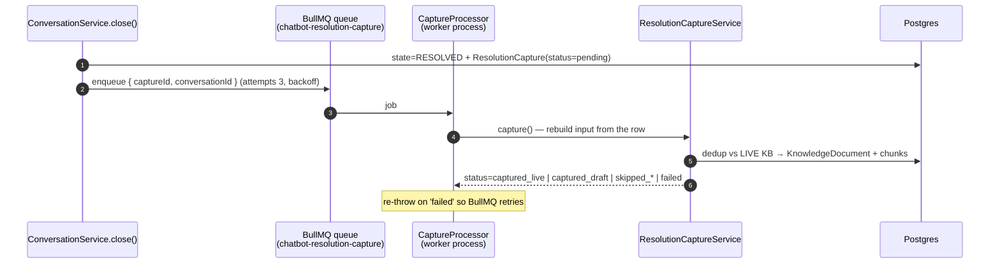
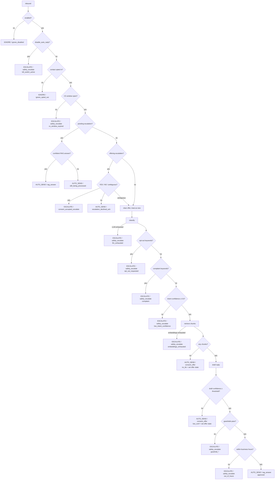
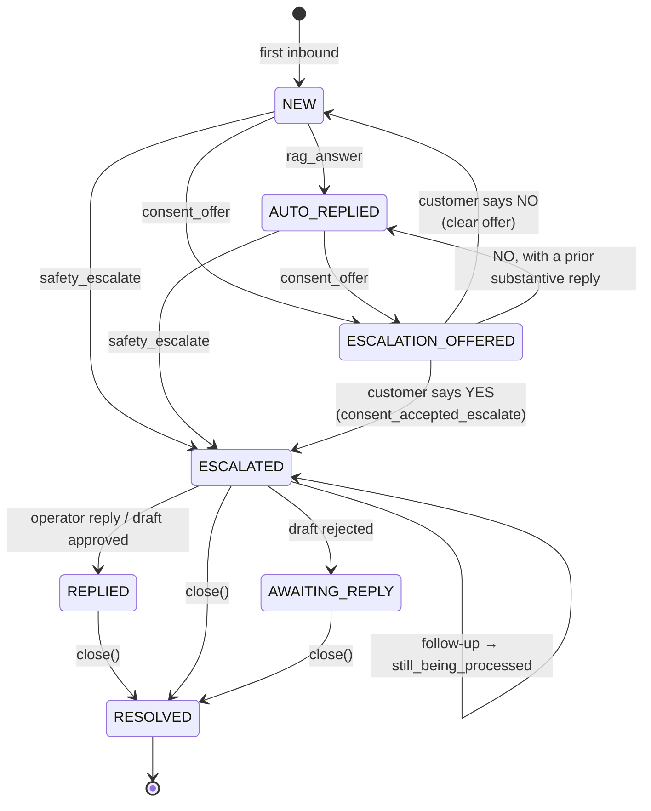
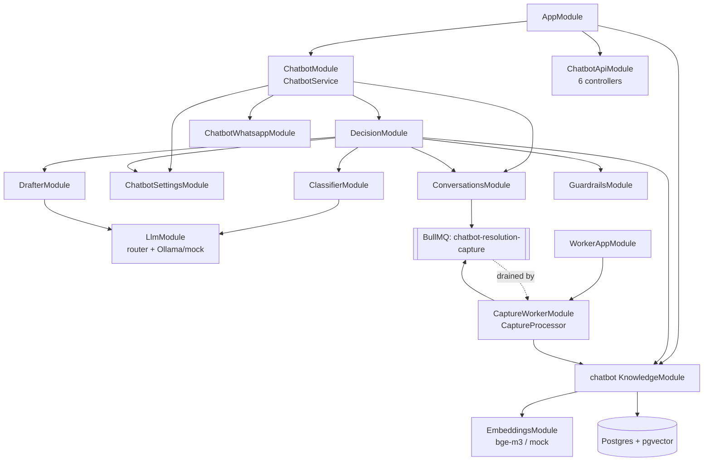

# Chatbot Architecture

How the AI chatbot module is wired, how a message flows through it, the exact decision tree, the
conversation state machine, and the module dependency graph. Diagrams are Mermaid (render on GitHub
or any Mermaid viewer).

See also: [README-chatbot.md](./README-chatbot.md) · [chatbot-runbook.md](./chatbot-runbook.md).

---

## 1. Data flow

A Meta webhook arrives, the (feature-flagged) bridge hands text inbounds to the orchestrator, the
orchestrator asks the decision engine what to do, persists the decision, then carries out the
verdict. Resolution capture runs asynchronously in the worker process.

```mermaid
sequenceDiagram
    autonumber
    participant Meta as Meta WhatsApp
    participant WH as WebhookController
    participant CB as ChatbotService<br/>(orchestrator)
    participant CV as ConversationService
    participant DE as DecisionEngine
    participant KB as Classifier / Retrieval / Drafter / Guardrails
    participant DB as Postgres (+pgvector)
    participant WA as ChatbotWhatsappService

    Meta->>WH: POST /api/webhooks/meta (signed)
    Note over WH: verify signature;<br/>skip unless CHATBOT_ENABLED=true
    WH->>CB: handleInbound({contacts, message})
    CB->>DB: find contact by phone (skip if unknown / non-text)
    CB->>CV: handleInbound() → find/create conversation + inbound msg
    CB->>CV: getCsWindowOpen()
    CB->>DE: decide({body, optedIn, csWindowOpen, businessName, conversationId})
    DE->>KB: classify → retrieve (embed + vector search) → draft → guardrails
    KB-->>DE: intent / chunks / draft / pass·fail
    DE-->>CB: Decision (kind, subKind, reason, draftBody?, sideEffects?, telemetry)
    CB->>DB: persist ChatbotDecision (audit) + log structured line
    alt AUTO_SEND
        CB->>WA: sendTextMessage(phone, draftBody)
        CB->>CV: recordAutoReply / recordEscalationOffer / clearOfferState
        CB->>DB: BotDraft (SENT) + citations  (rag_answer only)
    else ESCALATE
        CB->>CV: recordEscalation → PENDING BotDraft, state=ESCALATED
        opt consent_accepted_escalate
            CB->>WA: send ack first, then escalate original question
        end
    else IGNORE
        Note over CB: decision already persisted; nothing else
    end
```

**Resolution capture (separate, async):**



---

## 2. Decision tree

The exact order of checks in `DecisionEngine.decide()`. The first matching branch wins; later
branches never run. (`safety_escalate` is one sub-kind; its `reason` records the specific cause.)



---

## 3. Conversation state machine

`ConversationState` transitions. `handleInbound` never moves state on a follow-up — only the
engine's recorded outputs do. A conversation is closable (→ `RESOLVED`) from `REPLIED`,
`ESCALATED`, or `AWAITING_REPLY`.



---

## 4. Module dependencies

The orchestrator (`ChatbotModule`) and the REST surface (`ChatbotApiModule`) are registered in
`AppModule`; the capture processor runs only in `WorkerAppModule`. The BullMQ root is app-global
(supplied by `BlastsModule` / `BlastWorkerModule`), so the chatbot modules only *register the queue*,
never a second root.



**Notes**

- `ChatbotService` is the only orchestrator entry point (`handleInbound`); it sequences side-effects
  the engine signals via `decision.sideEffects` and owns the chatbot's *own* Meta client (never the
  blasting one).
- `DecisionEngine` is pure logic — it never sends or persists; the orchestrator does.
- Retrieval is pure pgvector cosine similarity over `LIVE` documents' chunks (HNSW index).
- The worker process is the sole consumer of the capture queue; the API side only produces to it.
