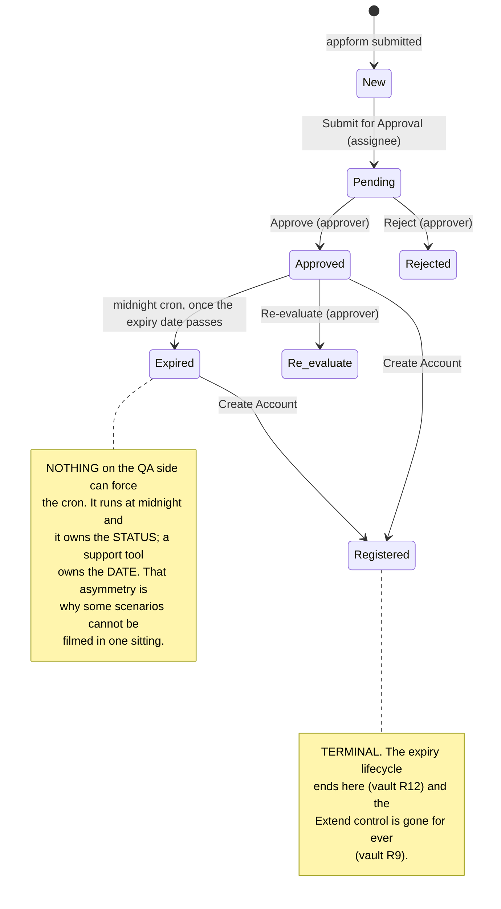
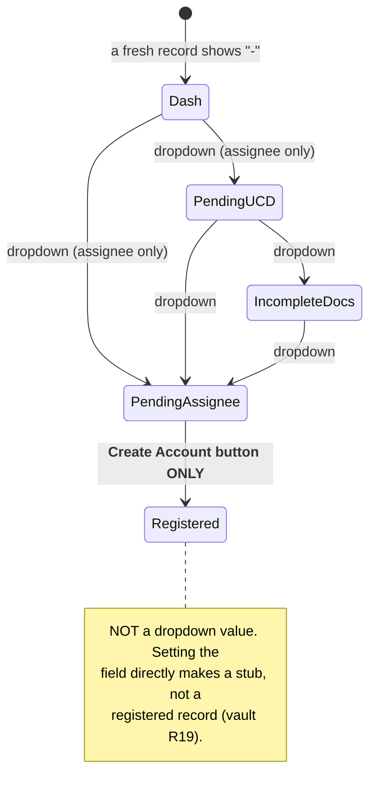

# The flow as a diagram

Paste into any Mermaid renderer (GitHub, Jira with the plugin, mermaid.live).

## The journey, and who does what

```mermaid
flowchart TD
    subgraph D1["DEALER — public UCD"]
      A["1 gate<br/>/obs/preOnb/recaptcha<br/><b>HUMAN: one tick</b>"]
      B["2 preapp<br/>Pre-Application Form<br/>+ Business Info Review<br/><b>RM 108.00 via FPX</b>"]
      A --> B
    end

    subgraph B1["BACKOFFICE — approver (ops_jasons)"]
      C["3 approve-preapp<br/>/obs/admin/preOnb/summary/uuid<br/>Approve -> APPROVED<br/><b>Application Link appears</b>"]
    end
    B --> C

    subgraph D2["DEALER — application link"]
      E["4 appform<br/>/obs/form/sec?id=..&s=..&v=1<br/>1 Business Info / 2 Upload Files / 3 Acknowledgement<br/><b>mints Application No + expiry = creation+90d</b>"]
    end
    C --> E

    subgraph B2["BACKOFFICE"]
      F["5 assign — APPROVER<br/>sidebar Assignee dropdown + Save"]
      G["6 submit-approval — ASSIGNEE<br/>UCD Group + Submit for Approval<br/>status -> Pending"]
      H["7 approve-app — APPROVER<br/>Approve -> Approved<br/><b>Registration Documents tab appears</b>"]
      F --> G --> H
    end
    E --> F

    subgraph D3["DEALER"]
      I["8 regdocs<br/>step 4 — six RHB/eAuto/LHDN documents"]
    end
    H --> I

    subgraph B3["BACKOFFICE — assignee"]
      J["9 verify-regdocs<br/>/obs/admin/form/edit-registration-doc/uuid<br/>press Verified"]
    end
    I --> J

    subgraph D4["DEALER"]
      K["10 regfee<br/>step 5 Payment<br/><b>RM 990.00 via FPX</b>"]
    end
    J --> K

    L["11 record<br/>/obs/admin/enquiry<br/>read the finished record"]
    K --> L

    M["<b>FIXTURE BUILD STOPS HERE</b><br/>Approved + docs Verified + fee paid"]
    L --> M

    N["Hardcopy Doc -> Pending Assignee<br/>(ASSIGNEE only)"]
    O["Create Account -> confirm dialog -> Yes"]
    P["Create New Company Account form<br/>/uat4/view/account/company-obs/new.do?id=uuid<br/>149 controls, Save at the TOP"]
    Q["<b>REGISTERED</b><br/>terminal, irreversible"]
    M -.-> N -.-> O -.-> P -.-> Q

    style A fill:#ffe3e3,stroke:#c92a2a
    style M fill:#e7f5ff,stroke:#1971c2
    style Q fill:#fff4e6,stroke:#e8590c
```

## Application Status

## Hardcopy & Acc Created — the second, independent axis

This is the field people confuse with Application Status, and it is the one that
decides whether the *Create Account* and *Extend* controls render at all.

The dropdown offers **exactly three** values, read off the markup:
`PENDING_UCD` · `PENDING_UCD_INCOMPLETE_DOCS` · `PENDING_ASSIGNEE`.

| Hardcopy & Acc Created | Create Account button | Extend control (11982 only) |
| --- | --- | --- |
| `-` | no | — |
| Pending UCD | **no** | yes, per the window |
| Pending UCD - Incomplete Docs | **no** | yes, per the window |
| **Pending Assignee** | **YES** | yes, per the window |
| Registered | already done | **gone for ever** |

**The saving control is `#update-hardcopy-status`, and it does not exist until the
dropdown changes.** The page's only other "Save" is `#to-edit-final`, which posts the
*documents* form and has never carried `hardcopyStatus`. Only the **assignee** may
move this field.
